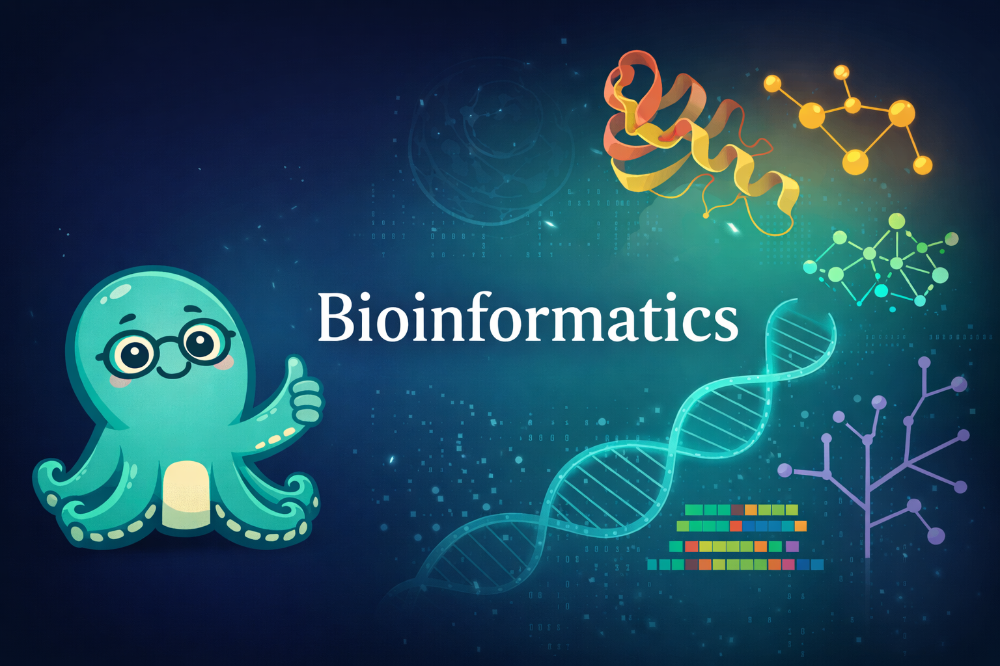

# Bioinformatics

{ width="100%" }

An interactive intelligent textbook for bioinformatics, designed for upper-division undergraduates, graduate students, and working professionals. This 14-week course covers everything from molecular biology foundations through graph-powered approaches to drug discovery, precision medicine, and multi-omics integration — with hands-on labs using Python, NetworkX, Neo4j, and visualization tools throughout.

## Features

- **Interactive MicroSims** — computational simulations and interactive diagrams for every major concept
- **Learning Graph** — visual map of all 480 course concepts and their dependencies
- **Bloom's Taxonomy Alignment** — learning objectives at all six cognitive levels
- **Graph Data Models** — every module includes a graph data model connecting biology to computation
- **Hands-On Labs** — Python, NetworkX, Vis-Network, and Cypher exercises in every module
- **Capstone Projects** — six real-world bioinformatics projects from antibiotic resistance to precision medicine

## How to Use This Book

Navigate using the sidebar on the left. Start with the [Course Description](course-description.md) for a full overview, then explore the [Learning Graph](learning-graph/index.md) to see how concepts connect before diving into chapters.
