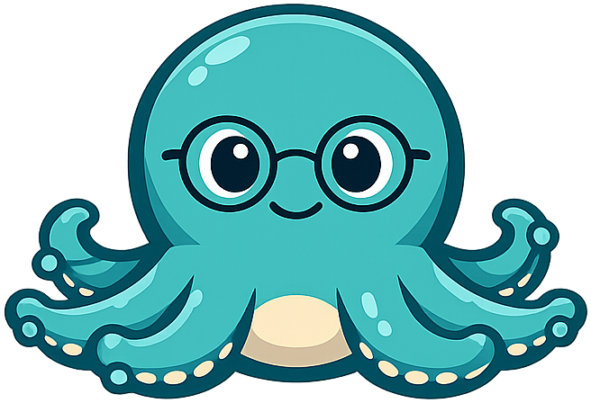
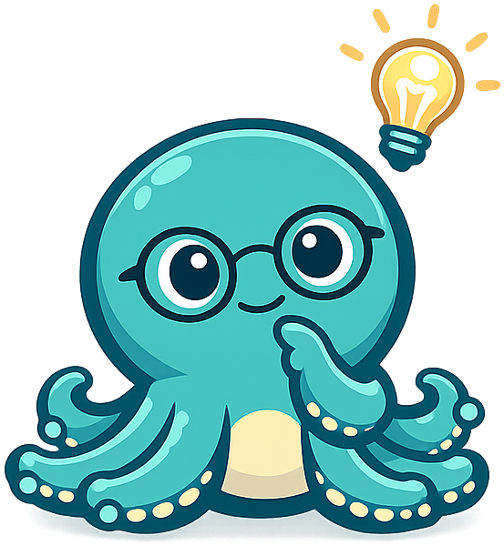
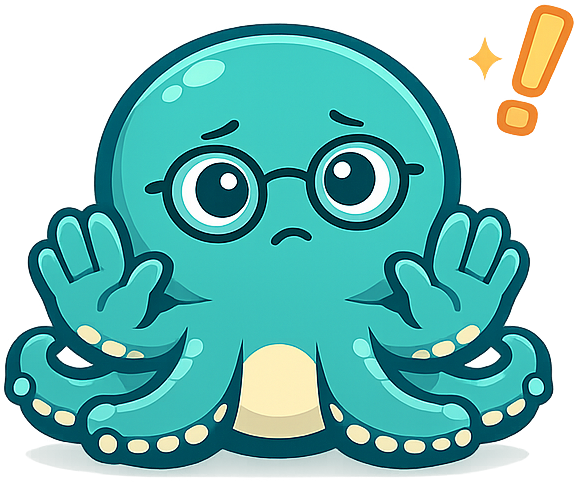
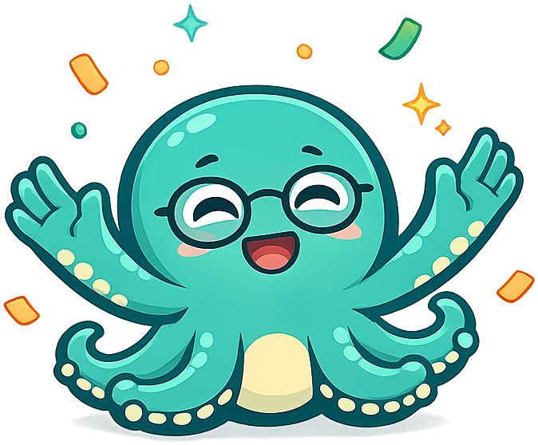
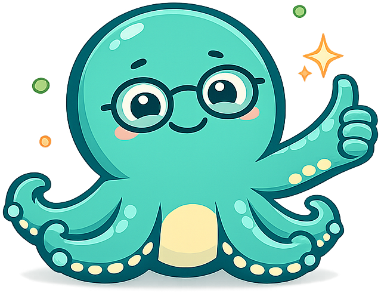

# Mascot Style Guide

This page shows all Olli the Octopus admonition styles for reference.

!!! mascot-neutral "A Note from Olli"

    
    This is the neutral style, used for general sidebars or introductions.
    Olli appears here for general-purpose notes that don't need a specific emotional tone.

!!! mascot-welcome "Welcome! Let's Connect the Dots!"

    
    This is the welcome style, used at chapter openings.
    Olli greets students and previews what they'll learn.

!!! mascot-thinking "Key Insight"

    
    This is the thinking style, used for key concepts and important insights.
    Olli highlights connections students should pay attention to.

!!! mascot-tip "Olli's Tip"

    
    This is the tip style, used for helpful hints and practical advice.
    Olli shares shortcuts and best practices.

!!! mascot-warning "Watch Out!"

    
    This is the warning style, used for common mistakes and pitfalls.
    Olli alerts students to frequent errors.

!!! mascot-celebration "Great Progress!"

    
    This is the celebration style, used for achievements and chapter completions.
    Olli celebrates milestones with students.

!!! mascot-encourage "You Can Do This!"

    
    This is the encouraging style, used when content gets difficult.
    Olli provides reassurance and motivation.