# List of MicroSims for Bioinformatics

Interactive Micro Simulations to help students learn bioinformatics fundamentals through exploration and experimentation.

-   **[AlphaFold Prediction Pipeline](./alphafold-pipeline/index.md)**

    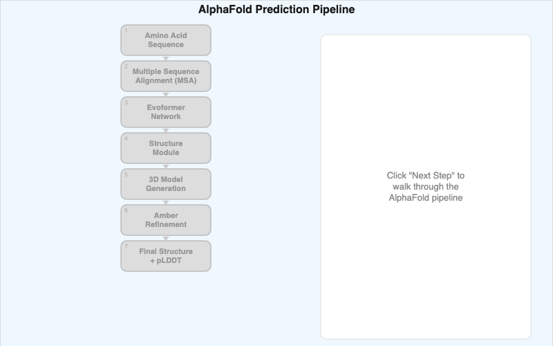

    Interactive visualization of the AlphaFold protein structure prediction pipeline, from sequence input through multiple sequence alignment to 3D structure output.

-   **[BFS vs DFS Traversal Comparison](./bfs-vs-dfs/index.md)**

    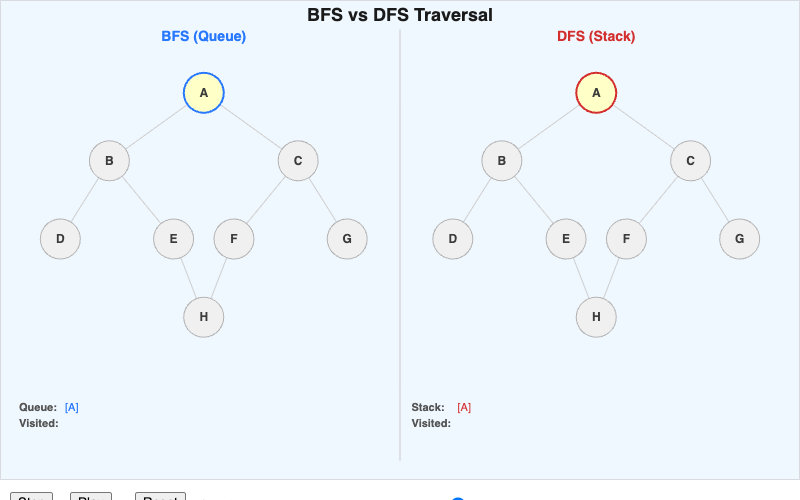

    Side-by-side comparison of breadth-first and depth-first graph traversal algorithms, showing visit order and frontier expansion on the same graph.

-   **[Biological Database Ecosystem](./bio-database-ecosystem/index.md)**

    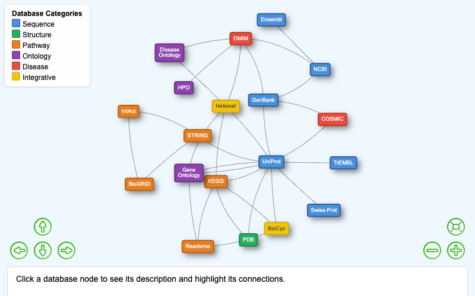

    Interactive vis-network diagram of the major biological databases and their interconnections, from sequence repositories to structure and pathway databases.

-   **[Anatomy of a Biomedical Knowledge Graph](./biomedical-kg-anatomy/index.md)**

    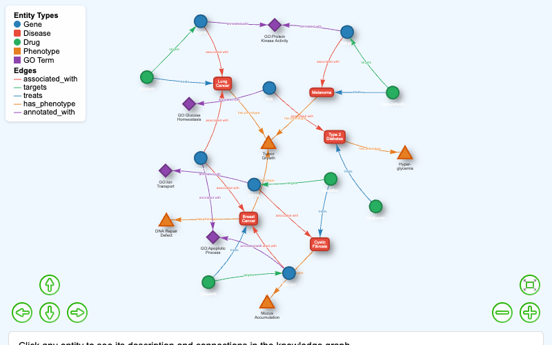

    Interactive vis-network showing the core entity types and relationships in a biomedical knowledge graph, including genes, diseases, drugs, and pathways.

-   **[Bipartite Metabolic Graph Structure](./bipartite-metabolic-graph/index.md)**

    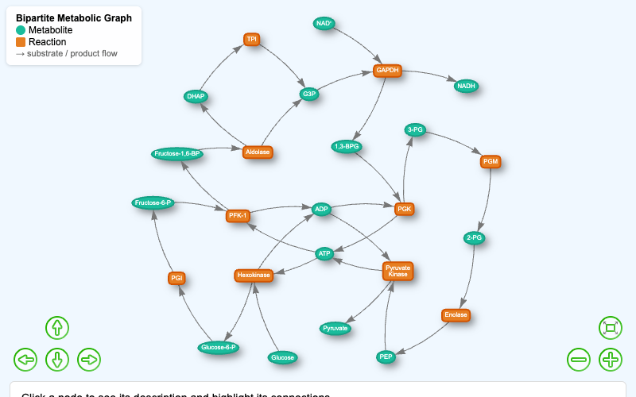

    Interactive vis-network showing the bipartite structure of metabolic networks with separate node types for metabolites and reactions.

-   **[Bipartite Metabolic Sub-network](./bipartite-metabolic/index.md)**

    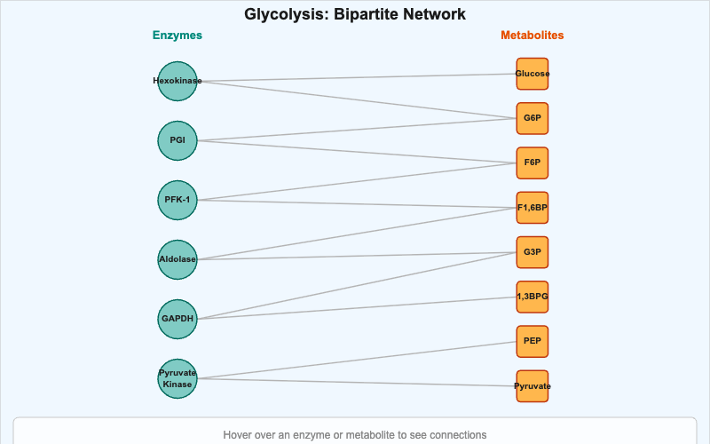

    Interactive p5.js visualization of a metabolic sub-network as a bipartite graph, showing metabolite and enzyme node partitions with reaction edges.

-   **[Central Dogma and Its Exceptions](./central-dogma-exceptions/index.md)**

    

    Interactive diagram of the central dogma (DNA → RNA → Protein) with clickable arrows revealing standard pathways and exceptions including reverse transcription, RNA replication, prions, and functional ncRNAs.

-   **[Central Dogma Information Flow](./central-dogma-flow/index.md)**

    

    Step-through visualization of genetic information flow from DNA through transcription and mRNA processing to translation and protein folding, with bioinformatics data formats at each stage.

-   **[Codon Table Explorer](./codon-table-explorer/index.md)**

    

    Translate mRNA sequences into amino acid chains using the standard genetic code. Supports custom input, random sequence generation, and reading frame visualization.

-   **[Co-Expression Network and Module Detection](./coexpression-network/index.md)**

    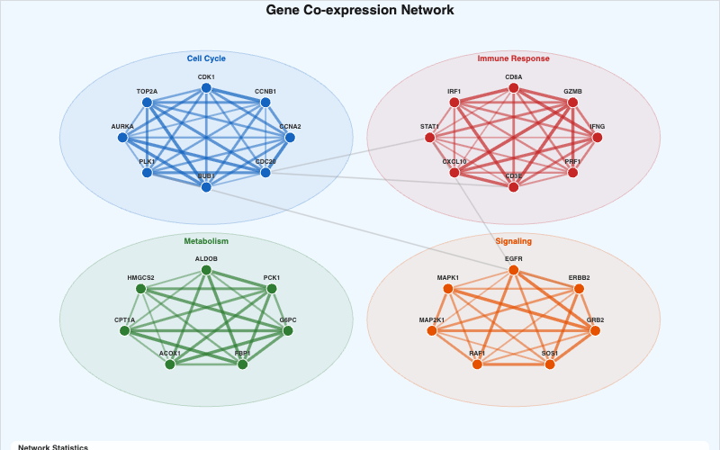

    Interactive visualization of gene co-expression networks with correlation-based edge weights and community detection to identify co-regulated gene modules.

-   **[Contact Map and Residue Interaction Network](./contact-map-rin/index.md)**

    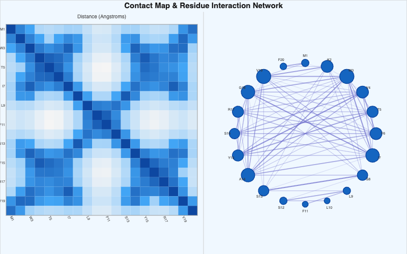

    Dual-view visualization showing a protein contact map alongside its residue interaction network, linking 2D distance matrices to 3D structural contacts.

-   **[De Bruijn Graph Construction](./de-bruijn-graph/index.md)**

    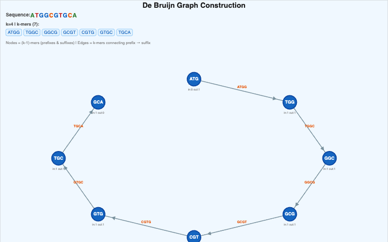

    Step-by-step construction of a de Bruijn graph from sequencing reads, demonstrating how k-mer overlap graphs enable genome assembly.

-   **[Disease Module in the Human Interactome](./disease-module-interactome/index.md)**

    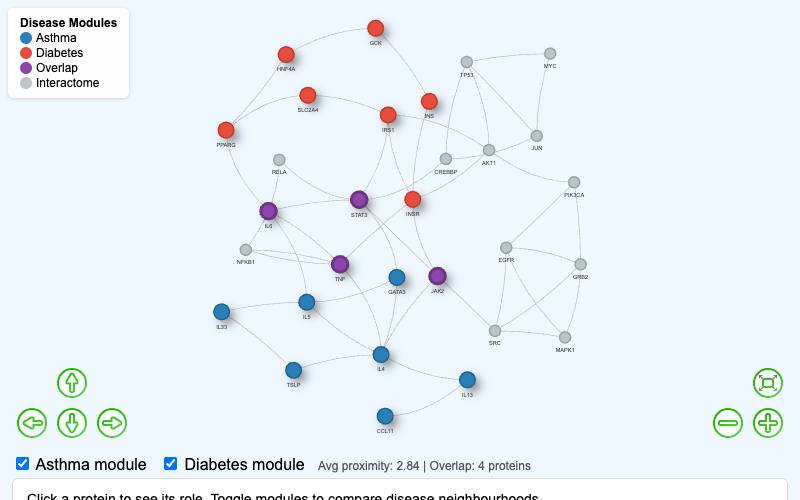

    Interactive vis-network showing how disease-associated genes cluster into modules within the human protein-protein interaction network.

-   **[Drug-Drug Interaction Network](./drug-drug-interaction-network/index.md)**

    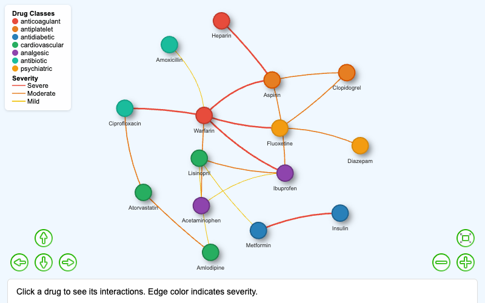

    Interactive vis-network visualization of drug-drug interactions showing pharmacological relationships and potential adverse interaction pathways.

-   **[Drug-Target-Disease Knowledge Graph](./drug-target-disease-graph/index.md)**

    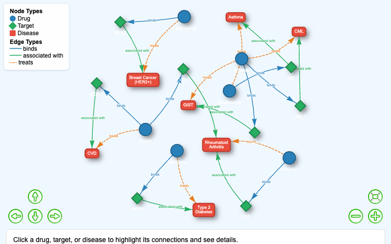

    Interactive vis-network showing the tripartite relationships between drugs, their protein targets, and associated diseases for drug repurposing exploration.

-   **[Dynamic Programming Matrix Visualization](./dp-alignment-matrix/index.md)**

    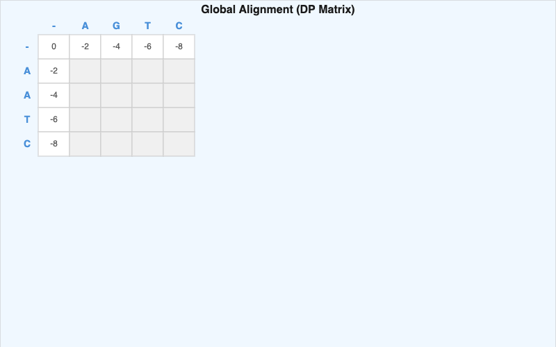

    Interactive visualization of the Needleman-Wunsch dynamic programming matrix for global sequence alignment, with traceback path highlighting.

-   **[FASTQ Quality Control Pipeline](./fastq-qc-pipeline/index.md)**

    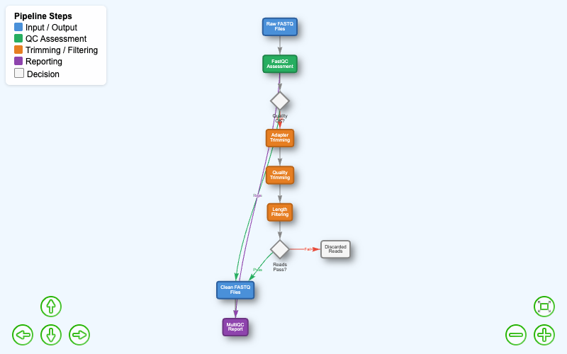

    Interactive pipeline visualization showing the steps of FASTQ quality control from raw reads through adapter trimming, quality filtering, and summary statistics.

-   **[Flux Balance Analysis Formulation](./fba-formulation/index.md)**

    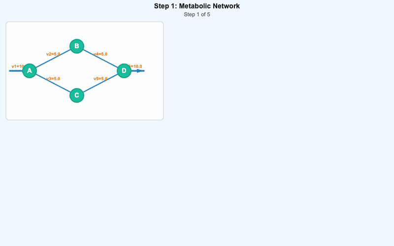

    Interactive visualization of flux balance analysis showing the stoichiometric matrix, flux constraints, and linear programming optimization of metabolic networks.

-   **[The Four Omics Layers](./four-omics-layers/index.md)**

    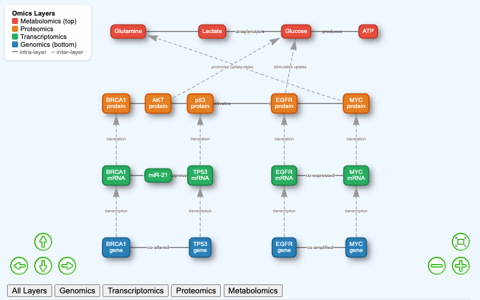

    Interactive vis-network diagram of the four major omics layers (genomics, transcriptomics, proteomics, metabolomics) and the data flow between them.

-   **[Gene Tree vs Species Tree Discordance](./gene-tree-species-tree/index.md)**

    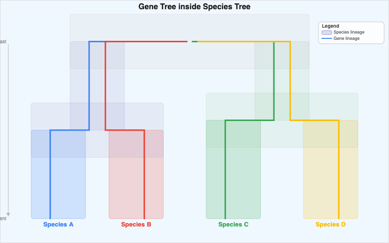

    Side-by-side comparison of gene trees and species trees showing how incomplete lineage sorting and horizontal gene transfer cause topological discordance.

-   **[Genome Assembly Pipeline Overview](./genome-assembly-pipeline/index.md)**

    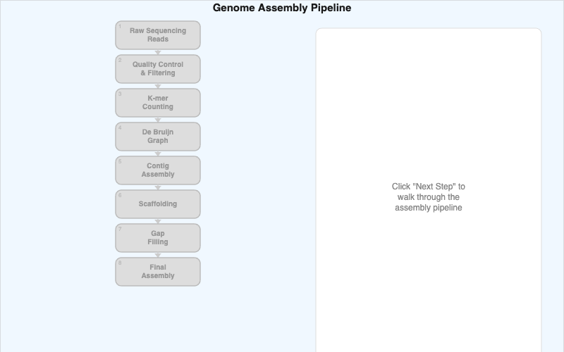

    Interactive pipeline visualization of the genome assembly process from raw reads through error correction, contig assembly, scaffolding, and quality assessment.

-   **[Graph-Based Discovery Pipeline](./graph-discovery-pipeline/index.md)**

    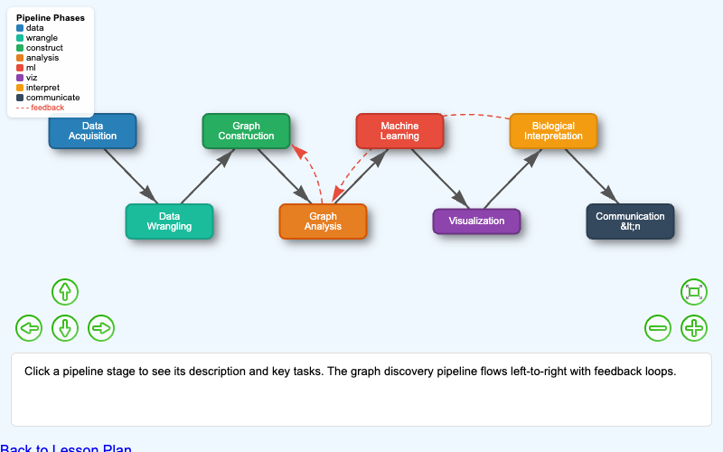

    Interactive vis-network showing the stages of graph-based biological discovery from data integration through knowledge graph construction to hypothesis generation.

-   **[Graph Data Model Design Process](./graph-data-model-design/index.md)**

    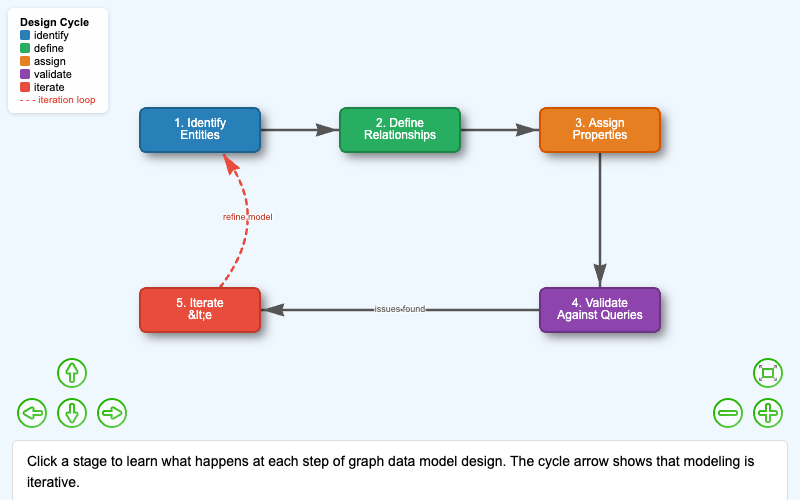

    Interactive vis-network visualization of the iterative process for designing graph data models for biological knowledge representation.

-   **[Graphlet Orbits and Network Comparison](./graphlet-analysis/index.md)**

    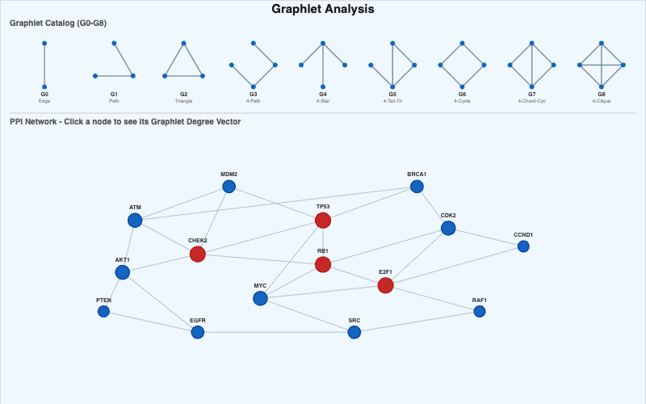

    Interactive visualization of graphlet subgraph patterns and orbit positions used for network motif analysis and biological network comparison.

-   **[Integrated Knowledge Graph Pipeline](./kg-integrated-pipeline/index.md)**

    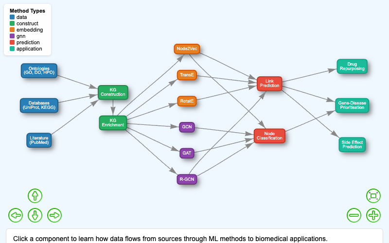

    Interactive vis-network showing the end-to-end pipeline for building an integrated biomedical knowledge graph from heterogeneous data sources.

-   **[Knowledge Graph Construction Pipeline](./kg-construction-pipeline/index.md)**

    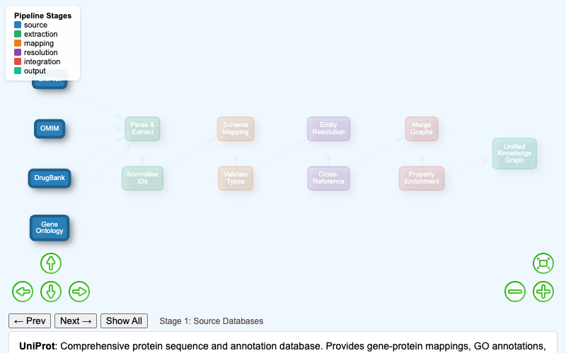

    Interactive vis-network visualization of the knowledge graph construction process from entity extraction through relation mapping to graph population.

-   **[Learning Graph Viewer](./graph-viewer/index.md)**

    

    Interactive vis-network visualization of all course concepts and their dependencies. Search, filter, and explore the bioinformatics learning graph.

-   **[Louvain vs. Leiden Community Detection](./louvain-vs-leiden/index.md)**

    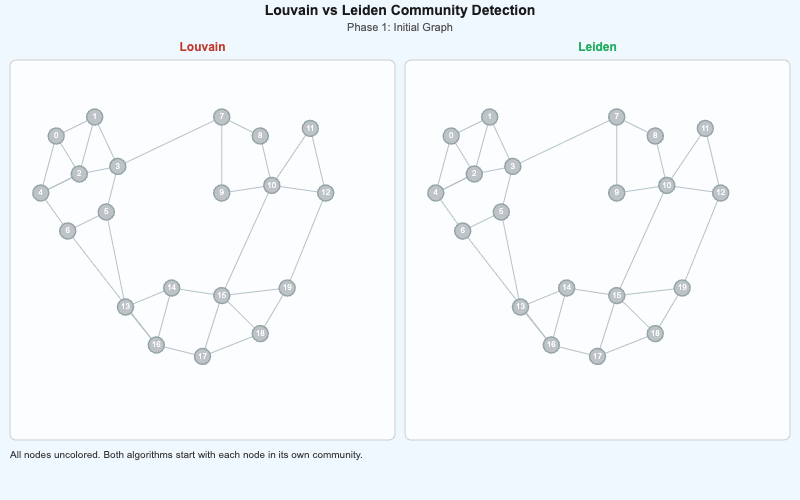

    Side-by-side comparison of the Louvain and Leiden community detection algorithms on the same network, highlighting resolution and quality differences.

-   **[Metabolic Network Overview](./metabolic-network-overview/index.md)**

    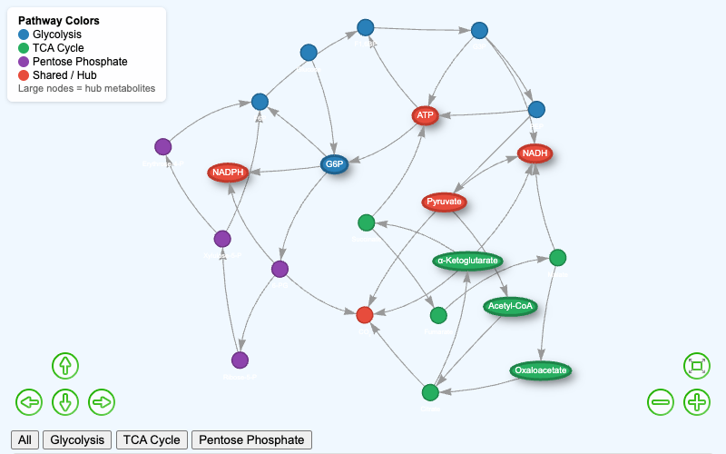

    Interactive vis-network overview of a metabolic network showing metabolites, enzymes, and reaction pathways with pathway highlighting.

-   **[Metabolomics to Network Mapping Pipeline](./metabolomics-pipeline/index.md)**

    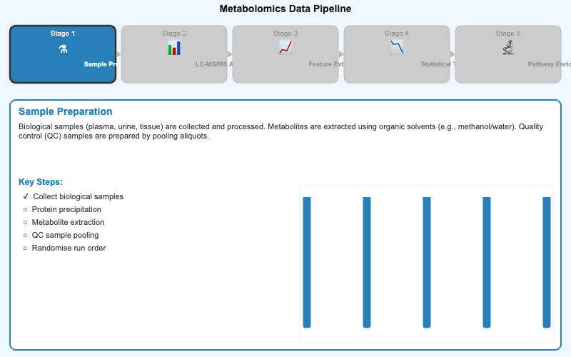

    Interactive pipeline showing how metabolomics data is processed and mapped onto metabolic network models for pathway analysis.

-   **[Molecular Docking and Protein-Ligand Graph](./molecular-docking-graph/index.md)**

    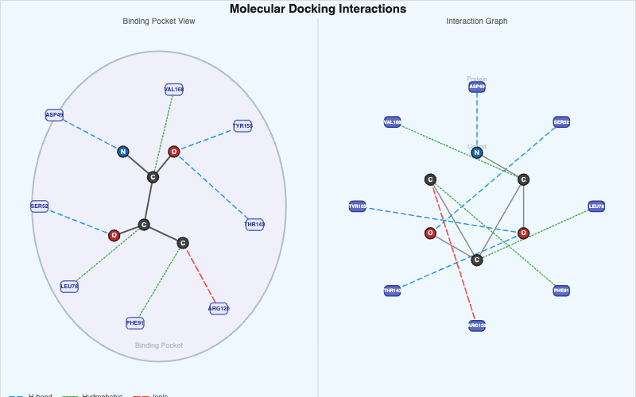

    Interactive visualization of molecular docking showing protein-ligand binding interactions as a graph with binding affinity scores and interaction types.

-   **[Module Detection in PPI Networks](./ppi-module-detection/index.md)**

    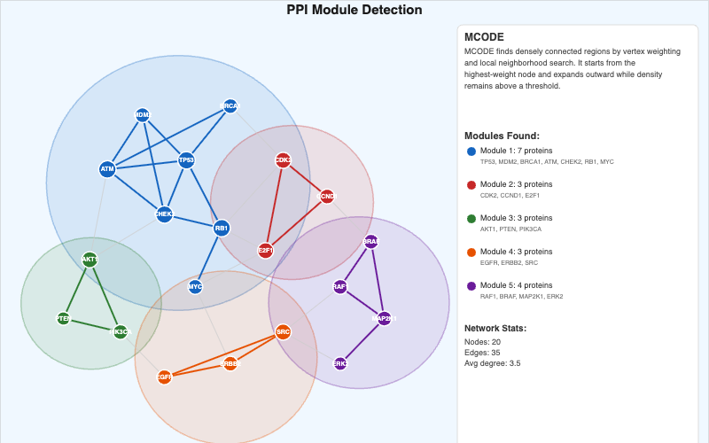

    Interactive visualization of protein complex and functional module detection within protein-protein interaction networks using clustering algorithms.

-   **[Mutation Types Explorer](./mutation-types-explorer/index.md)**

    

    Apply SNPs, insertions, deletions, and frameshifts to a DNA sequence and immediately see the downstream effect on mRNA codons and protein sequence with automatic mutation classification.

-   **[Network Model Comparison](./network-models/index.md)**

    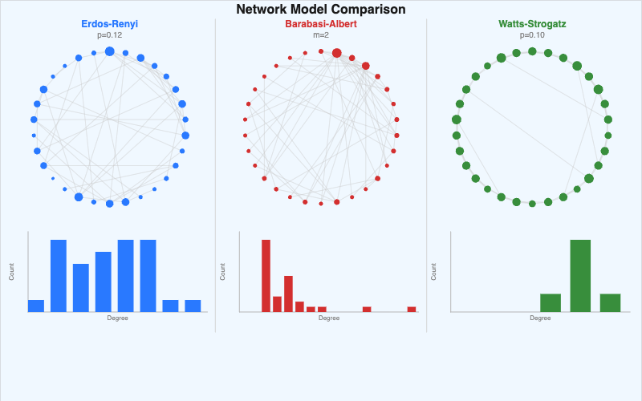

    Compare Erdos-Renyi, Barabasi-Albert, and Watts-Strogatz network models side by side with adjustable parameters and degree distribution charts.

-   **[Node2Vec Biased Random Walk](./node2vec-random-walk/index.md)**

    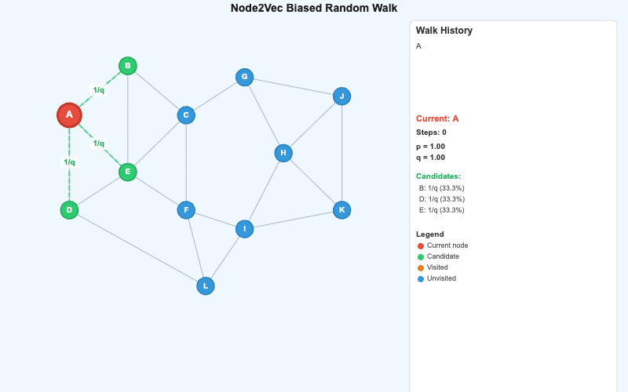

    Interactive visualization of the node2vec biased random walk algorithm showing how return parameter p and in-out parameter q control walk behavior for graph embedding.

-   **[Patient Similarity Network Construction](./patient-similarity-network/index.md)**

    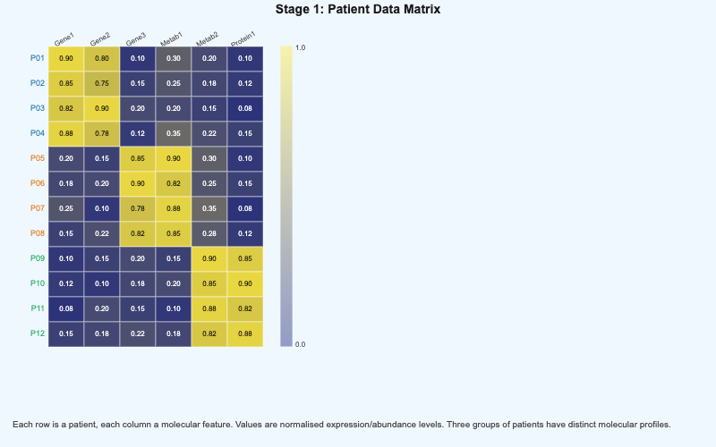

    Interactive visualization of how patient similarity networks are constructed from clinical features and used for disease subtype identification.

-   **[Phylogenetic Network with Reticulation Events](./phylogenetic-network/index.md)**

    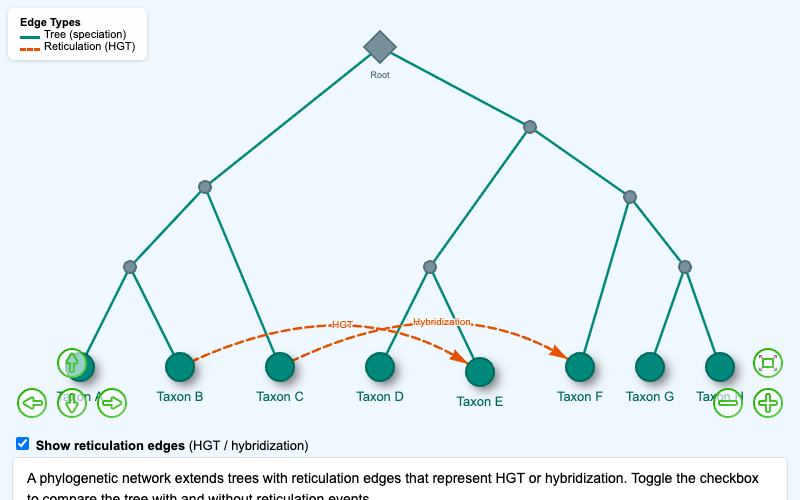

    Interactive vis-network showing phylogenetic networks with reticulation events such as hybridization, horizontal gene transfer, and recombination.

-   **[Rooted and Unrooted Phylogenetic Trees](./phylogenetic-tree-types/index.md)**

    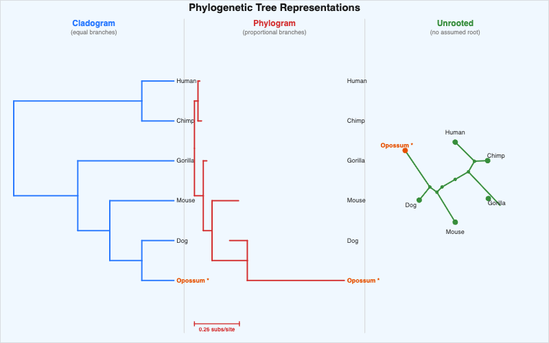

    Side-by-side comparison of rooted and unrooted phylogenetic tree representations showing how the presence of an outgroup changes tree interpretation.

-   **[PPI Knowledge Graph Schema](./ppi-knowledge-graph-schema/index.md)**

    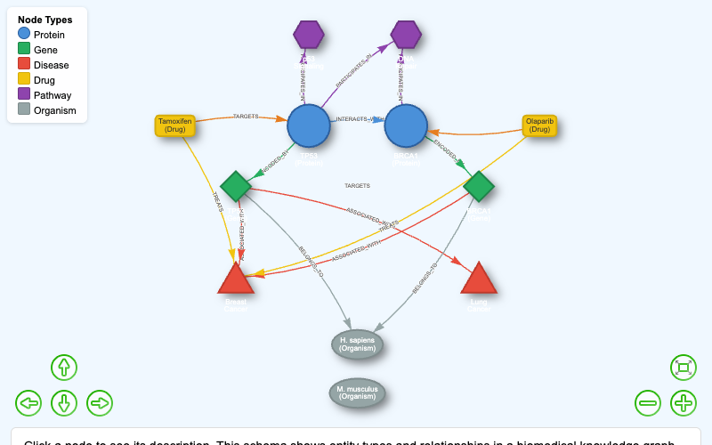

    Interactive vis-network showing the schema design for a protein-protein interaction knowledge graph with entity types, relationships, and properties.

-   **[PPI Network Topology Explorer](./ppi-topology-explorer/index.md)**

    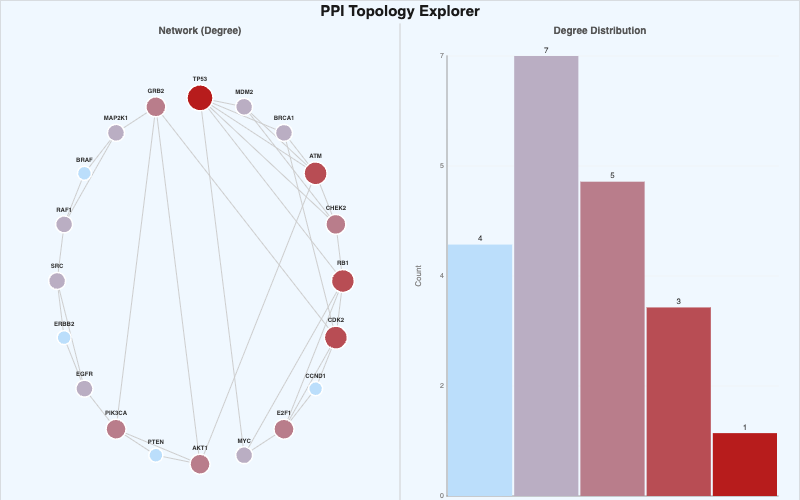

    Interactive exploration of PPI network topology metrics including degree distribution, betweenness centrality, clustering coefficient, and hub identification.

-   **[Profile HMM Architecture](./profile-hmm-architecture/index.md)**

    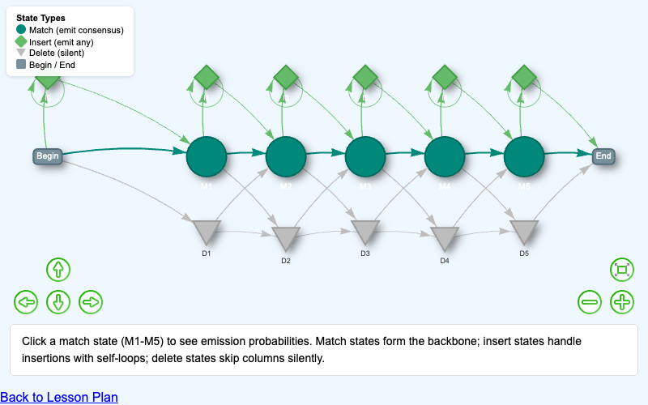

    Interactive vis-network diagram of a profile Hidden Markov Model showing match, insert, and delete states with transition probabilities for sequence family modeling.

-   **[Prokaryotic vs Eukaryotic Cell](./prokaryote-vs-eukaryote/index.md)**

    

    Dual-panel interactive diagram comparing prokaryotic and eukaryotic cell structures with explore mode, quiz mode, and labeled callouts highlighting shared and unique features.

-   **[Protein Interaction Network Overview](./ppi-network-overview/index.md)**

    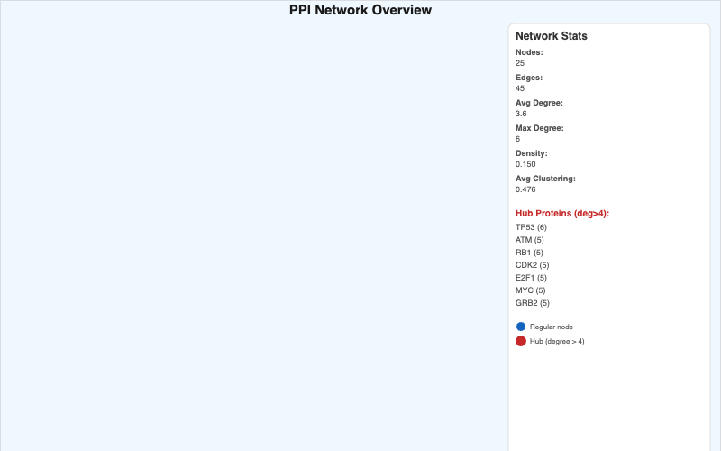

    Interactive overview of a protein-protein interaction network with node coloring by functional category and edge types representing different interaction evidence.

-   **[Protein Structure Hierarchy](./protein-structure-hierarchy/index.md)**

    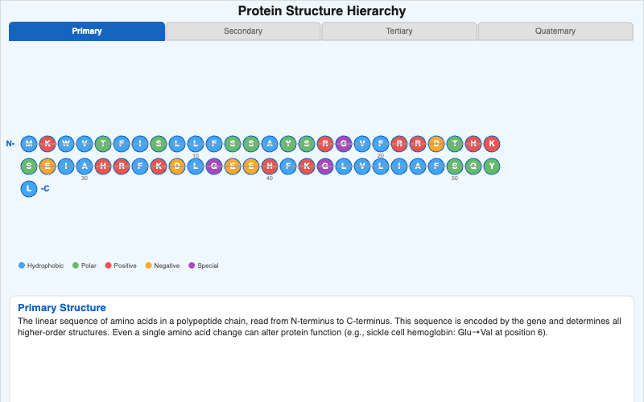

    Interactive visualization of the four levels of protein structure showing primary sequence, secondary elements, tertiary folding, and quaternary assembly.

-   **[Protein Structure Levels](./protein-structure-levels/index.md)**

    

    Click-to-expand display of the four levels of protein structure (primary, secondary, tertiary, quaternary) with stabilizing forces and bioinformatics data format connections.

-   **[RNA-Seq Pipeline Overview](./rnaseq-pipeline/index.md)**

    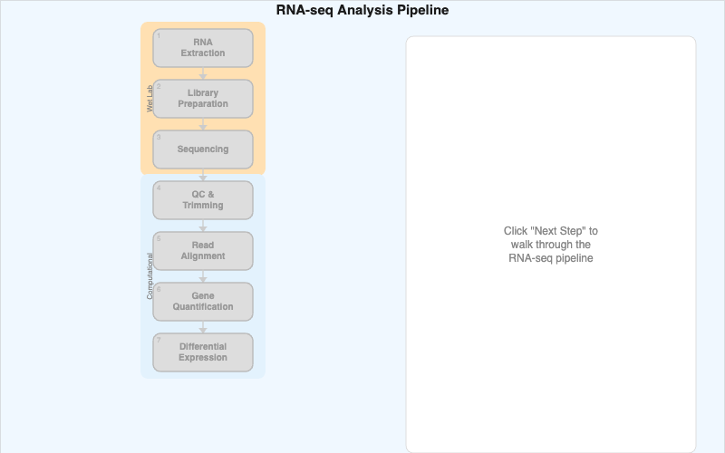

    Interactive pipeline visualization of the RNA-Seq analysis workflow from raw reads through alignment, quantification, normalization, and differential expression analysis.

-   **[Sequence Similarity Network](./sequence-similarity-network/index.md)**

    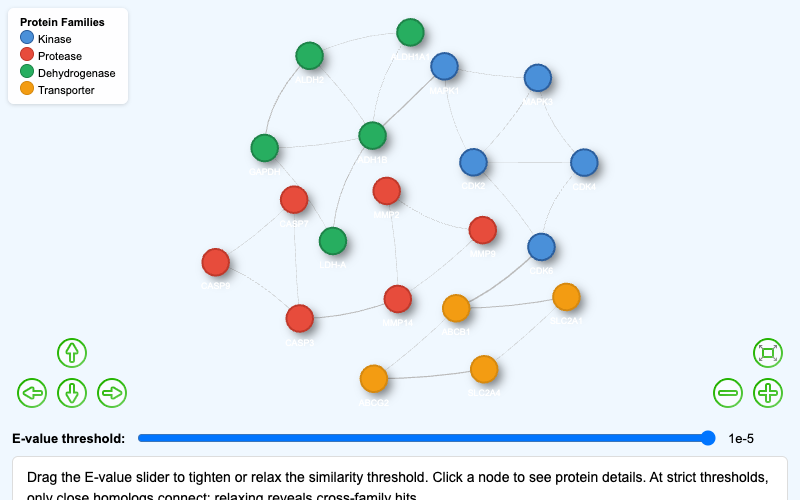

    Interactive vis-network showing how pairwise sequence similarity scores define edges in a network used for protein family clustering and functional annotation transfer.

-   **[Cell Signaling Cascade Overview](./signaling-cascade-overview/index.md)**

    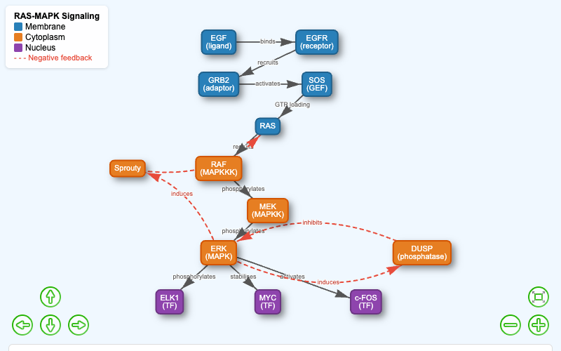

    Interactive vis-network visualization of a cell signaling cascade from receptor activation through kinase cascades to transcription factor activation and gene expression.

-   **[Single-Cell Clustering and Trajectory](./scrna-clustering/index.md)**

    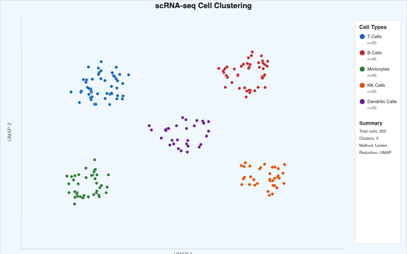

    Interactive visualization of single-cell RNA-seq data showing dimensionality reduction, cell type clustering, and pseudotime trajectory inference.

-   **[Text Mining Pipeline for Knowledge Graph Population](./text-mining-pipeline/index.md)**

    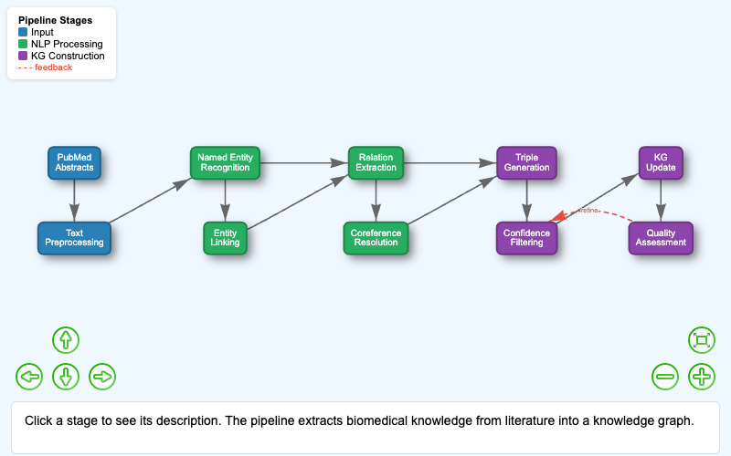

    Interactive vis-network showing the NLP pipeline for extracting biological entities and relationships from literature to populate knowledge graphs.

-   **[The Transcriptome Landscape](./transcriptome-landscape/index.md)**

    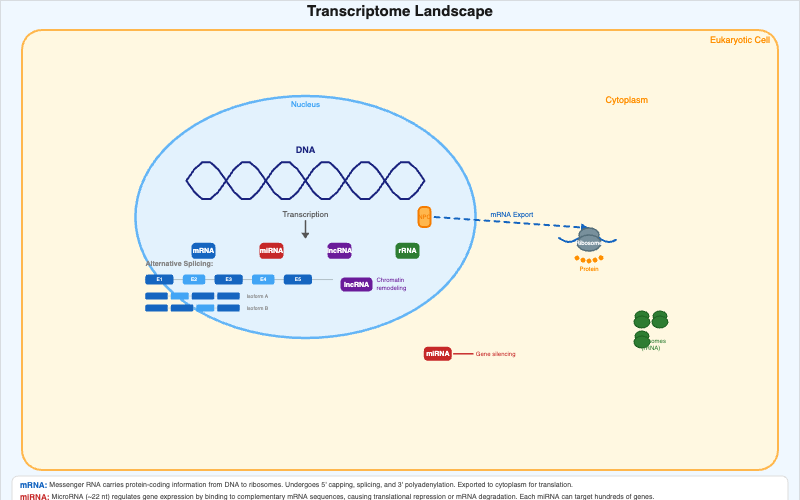

    Interactive visualization of the transcriptome landscape showing gene expression levels across conditions with differential expression highlighting.

-   **[Variation Graph for a Genomic Region](./variation-graph/index.md)**

    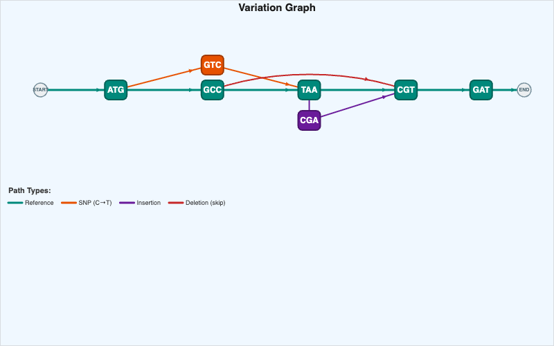

    Interactive visualization of a variation graph showing how SNPs, insertions, and deletions create alternate paths through a reference genomic sequence.

-   **[Volcano Plot for Differential Expression](./volcano-plot/index.md)**

    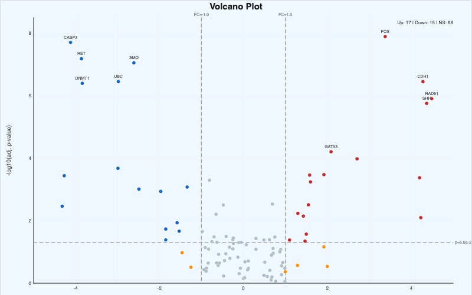

    Interactive volcano plot showing fold change vs. statistical significance for differential gene expression, with adjustable thresholds for identifying up- and down-regulated genes.

