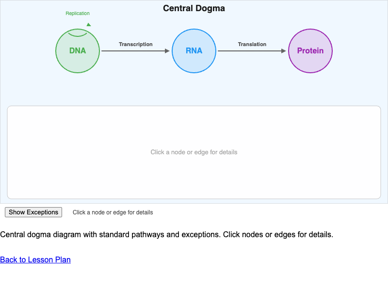
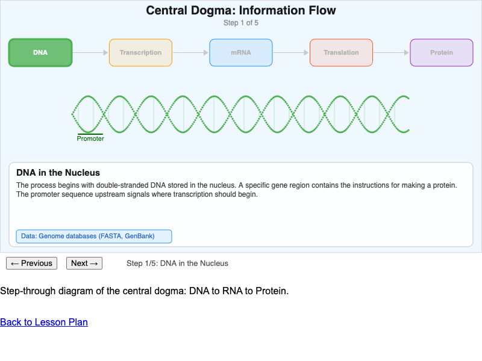
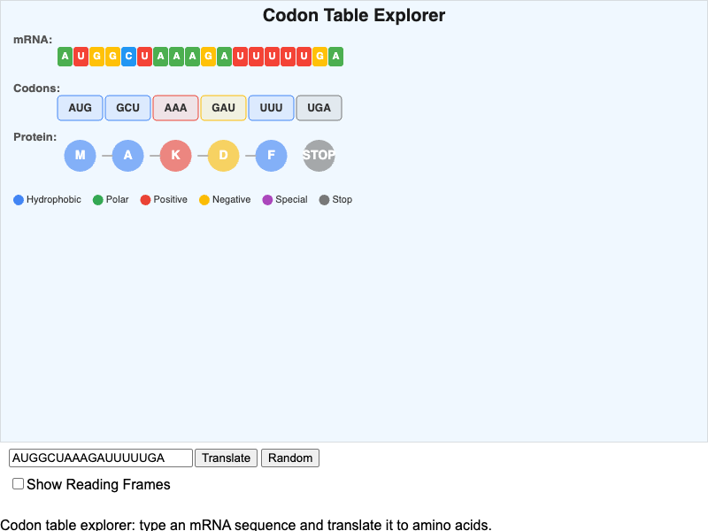
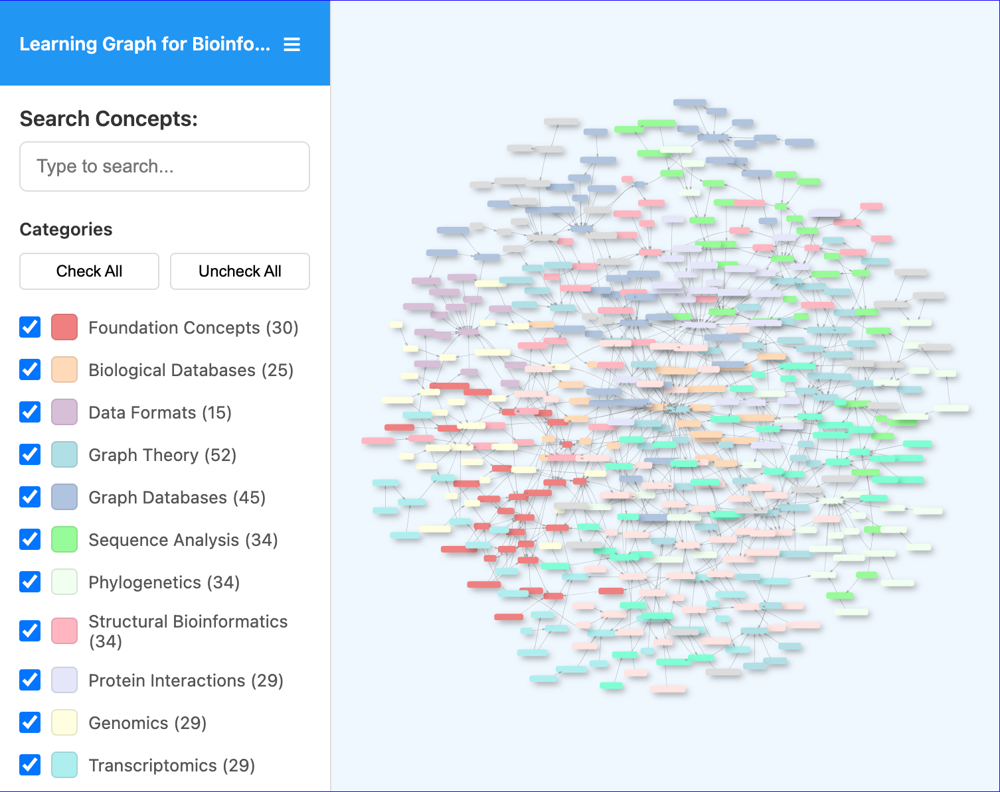
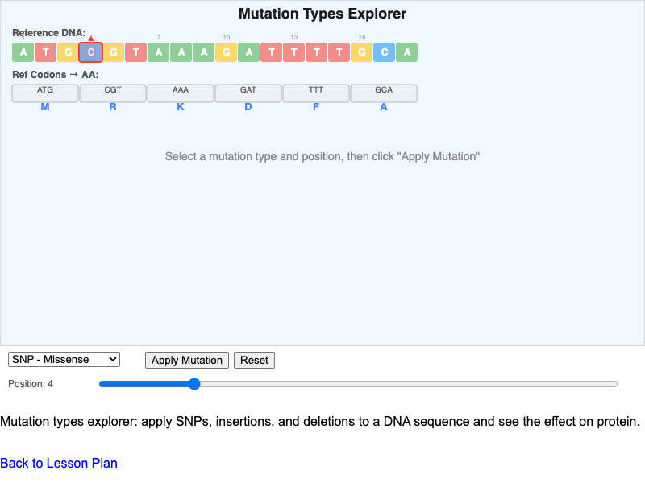
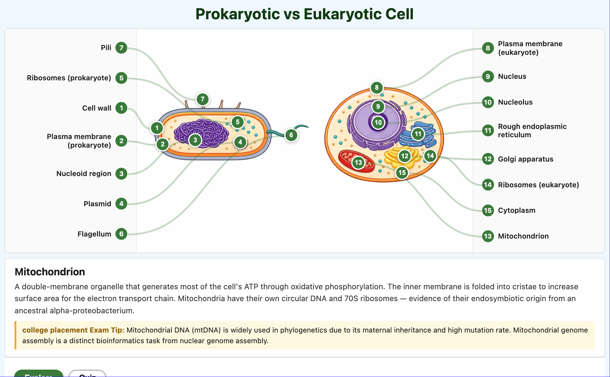
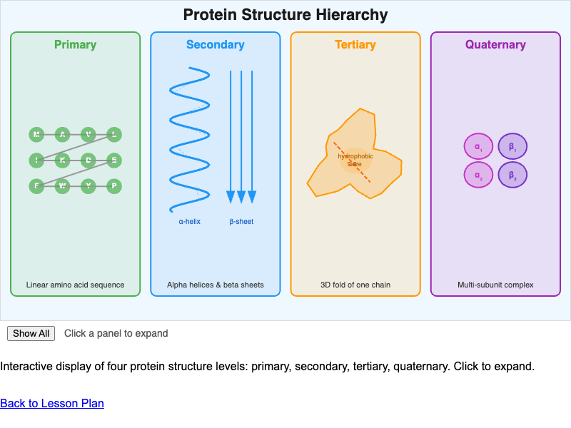

# List of MicroSims for Bioinformatics

Interactive Micro Simulations to help students learn bioinformatics fundamentals through exploration and experimentation.

-   **[Central Dogma and Its Exceptions](./central-dogma-exceptions/index.md)**

    

    Interactive diagram of the central dogma (DNA → RNA → Protein) with clickable arrows revealing standard pathways and exceptions including reverse transcription, RNA replication, prions, and functional ncRNAs.

-   **[Central Dogma Information Flow](./central-dogma-flow/index.md)**

    

    Step-through visualization of genetic information flow from DNA through transcription and mRNA processing to translation and protein folding, with bioinformatics data formats at each stage.

-   **[Codon Table Explorer](./codon-table-explorer/index.md)**

    

    Translate mRNA sequences into amino acid chains using the standard genetic code. Supports custom input, random sequence generation, and reading frame visualization.

-   **[Learning Graph Viewer](./graph-viewer/index.md)**

    

    Interactive vis-network visualization of all 480 course concepts and their dependencies. Search, filter, and explore the bioinformatics learning graph.

-   **[Mutation Types Explorer](./mutation-types-explorer/index.md)**

    

    Apply SNPs, insertions, deletions, and frameshifts to a DNA sequence and immediately see the downstream effect on mRNA codons and protein sequence with automatic mutation classification.

-   **[Prokaryotic vs Eukaryotic Cell](./prokaryote-vs-eukaryote/index.md)**

    

    Dual-panel interactive diagram comparing prokaryotic and eukaryotic cell structures with explore mode, quiz mode, and 15 labeled callouts highlighting shared and unique features.

-   **[Protein Structure Hierarchy](./protein-structure-levels/index.md)**

    

    Click-to-expand display of the four levels of protein structure (primary, secondary, tertiary, quaternary) with stabilizing forces and bioinformatics data format connections.

